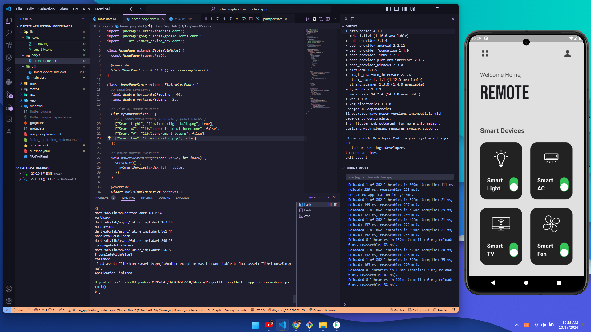

<div align="center">

# Flutter Modern Apps
  
> I am very very bored, give me a task to update or develop this bot? feature suggestions?

<p align="center">
 ini adalah source code saya belajar flutter
</p>

<p align="center">
  <a href="https://github.com/zzrftixx"></a>
</p>

<p align="center">
  <a href="https://github.com/IndonesianDev/whatsapp-bot"></a>
  <a href="https://github.com/IndonesianDev/whatsapp-bot/network/members"></a>
  <a href="https://github.com/IndonesianDev/whatsapp-bot/watchers"></a> <br>
  <a href="https://www.npmjs.com/package/@open-wa/wa-automate"></a>
  
   <br>
<a href="https://app.fossa.com/projects/git%2Bgithub.com%2FIndonesianDev%2Fwhatsapp-bot?ref=badge_shield" alt="FOSSA Status"></a>
</p>

# Code Me Make




# Sample from mitchkoko


</div>

# installation
## 📝 Cloning this repo
```bash
> git clone https://github.com/zzrftixx/ModernApps_Mobile.git
> cd ModernApps_Mobile
```


# Thanks to
* [`Github mitchkoko`](https://github.com/mitchkoko)